# Decimal 32-bit Floating-Point (Decimal32)

A web-based simulation of the IEEE 754 **decimal32** floating-point format,
built as part of the CSARCH2 computing-machine project. It includes a
monochrome (night-mode) graphical interface and reuses three Python modules
that implement the encoding, rounding, and arithmetic logic.

## Features

1. **Converter** — Converts a decimal number to its IEEE 754 decimal32
   representation (with special cases such as Infinity and NaN) in:
   - Binary, with proper field spacing
   - Hexadecimal
   - Plus a step-by-step parsing trace
2. **Rounding** — Rounds a decimal or binary number to a target precision
   using all four methods:
   - Chopping (toward zero)
   - Round up (toward +infinity)
   - Round down (toward −infinity)
   - Round to nearest, ties to even
3. **Arithmetic** — Performs subtraction or division on operands given in
   either decimal or IEEE hexadecimal form, using a selectable rounding
   method, and shows the step-by-step solution plus the final result in:
   - Decimal
   - Binary (spaced)
   - Hexadecimal

## Project structure

    ├── app.py                    # Flask web application + JSON API
    ├── decimal32.py              # Part 1: decimal → decimal32 encoder (DPD)
    ├── rounding.py               # Part 2: four rounding methods
    ├── arithmetic_operations.py  # Part 3: subtraction / division + hex decoder
    ├── requirements.txt
    ├── templates/index.html      # GUI markup (3 tabs)
    ├── screenshots/              # Documentation of terminal tests
    └── static/
        ├── css/style.css         # Night-mode stylesheet
        └── js/app.js             # Frontend logic

## Running the app

Requires Python 3.8+ and [Flask](https://flask.palletsprojects.com/).

    pip install -r requirements.txt
    python app.py

Then open <http://127.0.0.1:5000> in your browser.

## Using the terminal modules (optional)

Each module can also run standalone in the terminal:

    python decimal32.py
    python rounding.py
    python arithmetic_operations.py

## API endpoints

| Endpoint       | Method | Purpose                                              |
| -------------- | ------ | ---------------------------------------------------- |
| `/`            | GET    | Serves the web app                                   |
| `/api/encode`  | POST   | `{ base, exp }` → decimal32 binary/hex + trace       |
| `/api/round`   | POST   | `{ value, input_type, target_digits }` → 4 results   |
| `/api/arith`   | POST   | `{ operation, format, op1, op2, rounding }` → result |

## Example

| Input                        | Output |
| ---------------------------- | ------ |
| `122.5` (converter)          | `0 01000 100100 0000000001 0100100101` · `0x22400525` |
| `0.100101110 → 3 bits`       | chopping `0.100 x 2^0`, nearest `0.101 x 2^0` |
| `122.5 − 0.5` (ties to even) | `122.0` · `0 01000 100100 0000000001 0100100000` · `0x22400520` |

---

## Test Cases & Screenshots

The following screenshots demonstrate the parser's ability to handle standard conversions alongside IEEE 754 architectural extremes, proving mathematically accurate cohort normalization, boundary limits, and special formatting.

### 1. Normal Cases
* **Small MSD (0-7):** Demonstrates standard Combination Field parsing.
   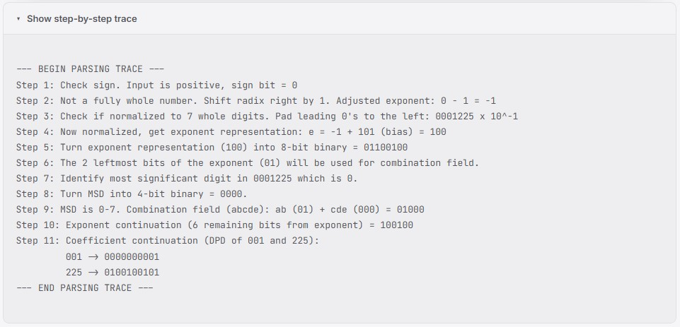
   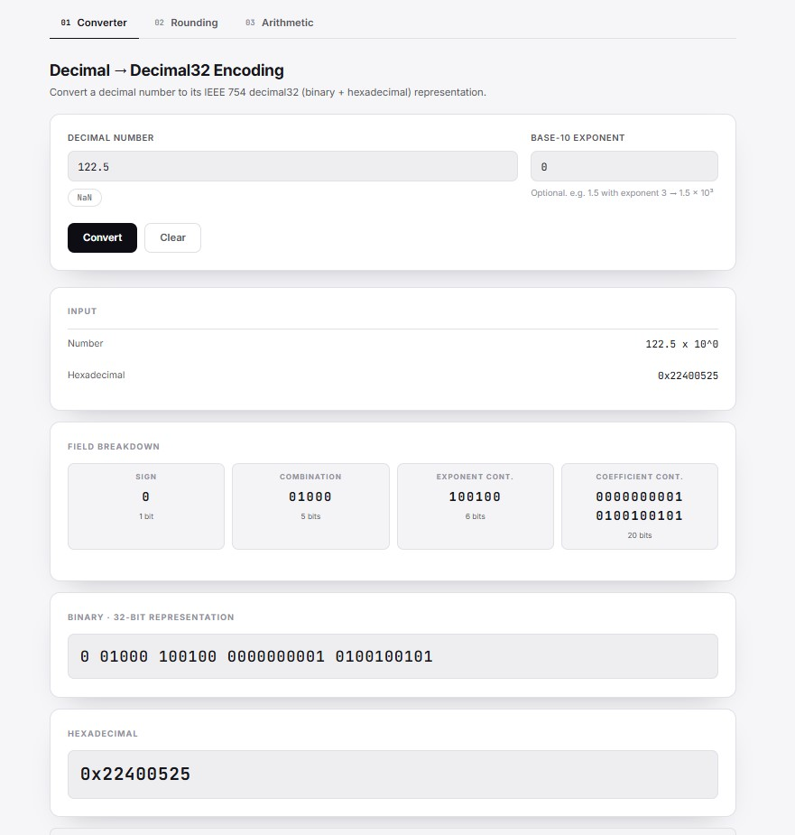

* **Large MSD (8-9):** Demonstrates the required `11 + ab + e` Combination Field shift.
   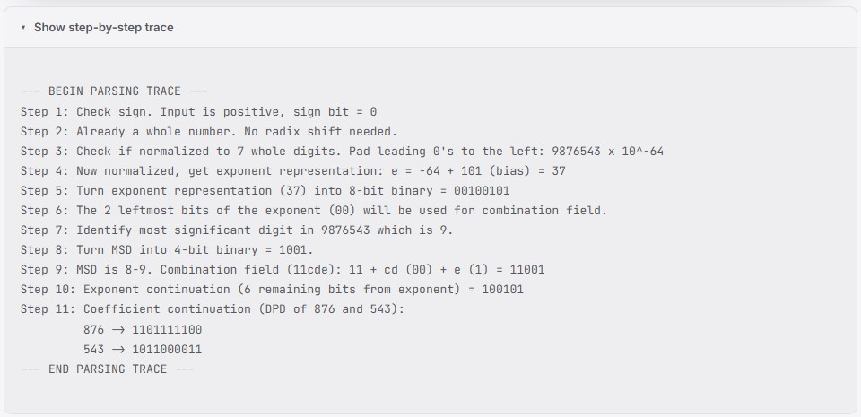
   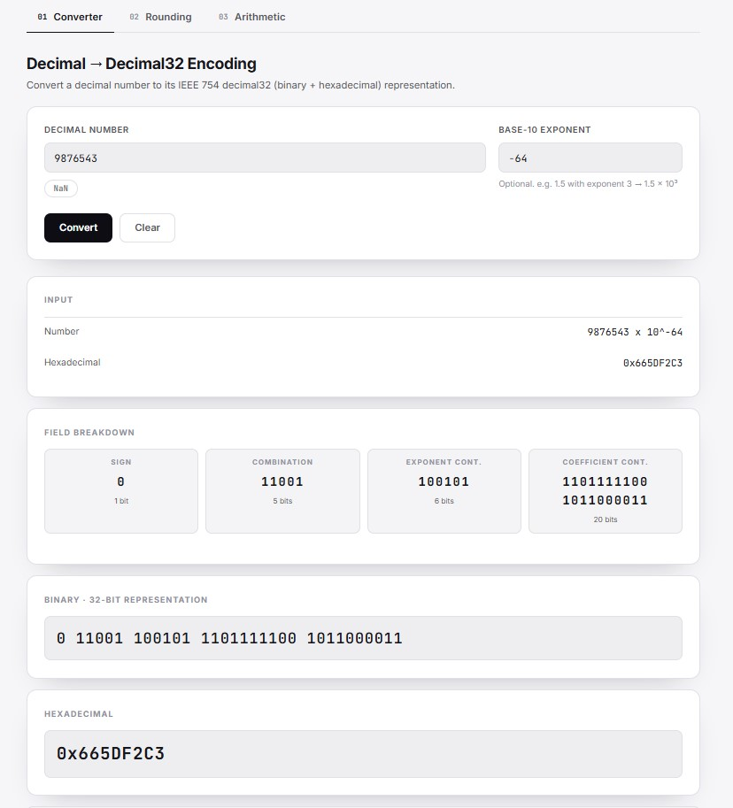

### 2. Special Cases
* **Positive Infinity (Induced Overflow):** Exceeds the maximum exponent limit of 90 after cohort shifting.
   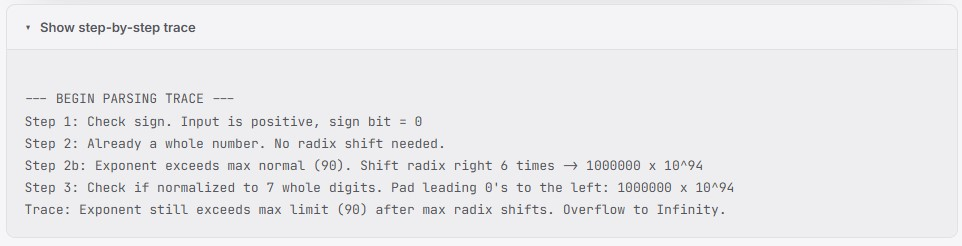
   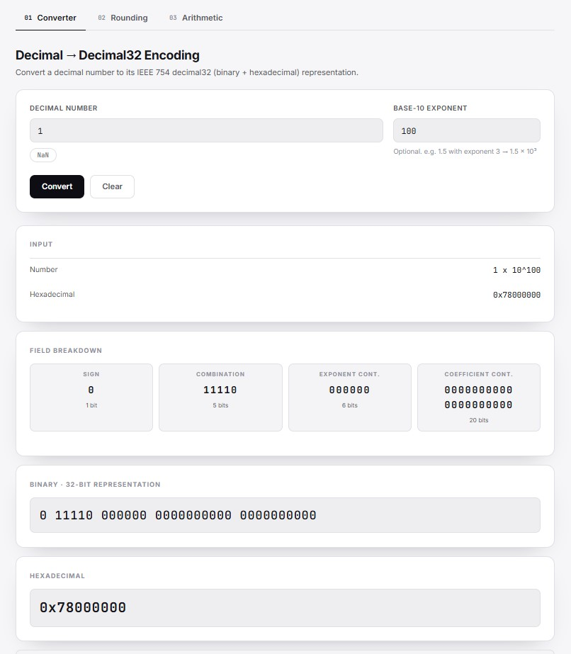

* **NaN (Not a Number):** Demonstrates explicit string catching for undefined operations.
   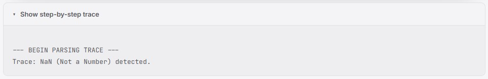
   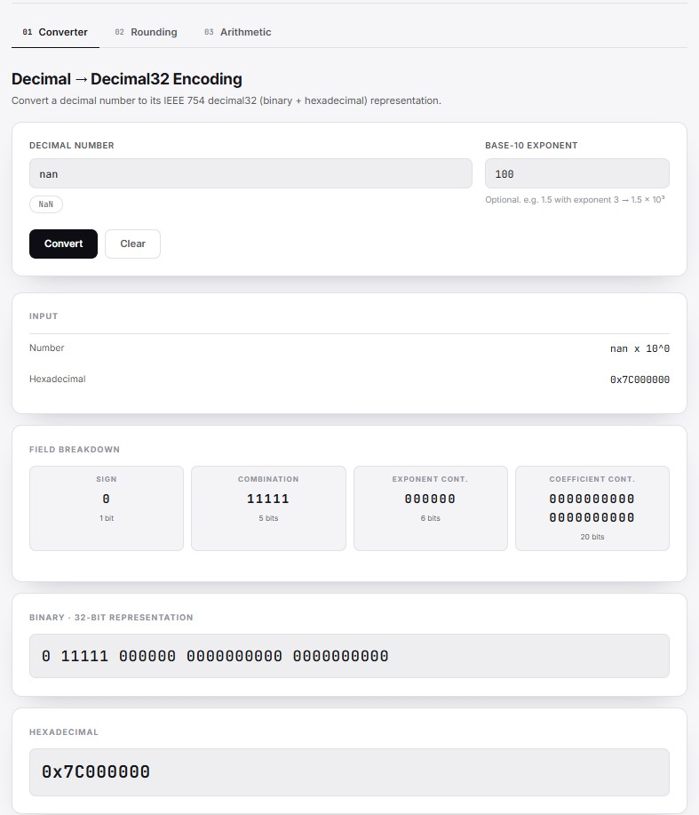

### 3. Edge Cases
* **Signed Zeros:** Proves sign preservation and exponent bias data retention for zero values.
   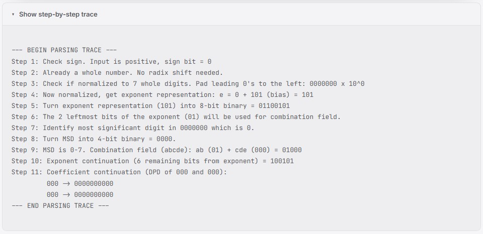
   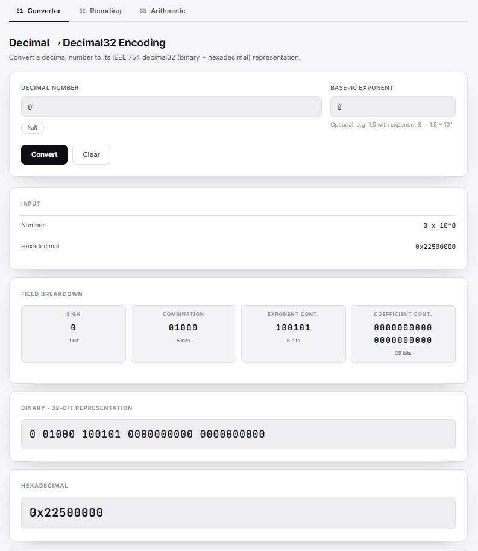

* **Upper Bound Cohort Shift (Emax):** Demonstrates right-shift radix normalization to drop the exponent to the maximum bound (90).
   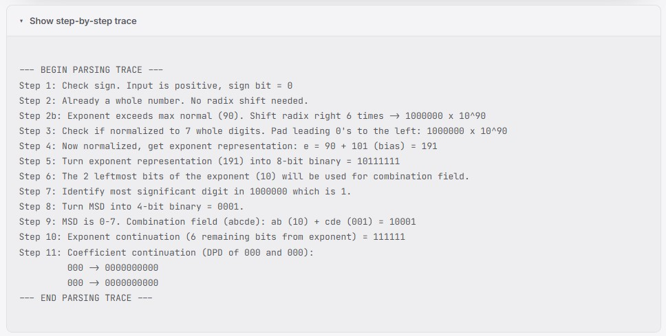
   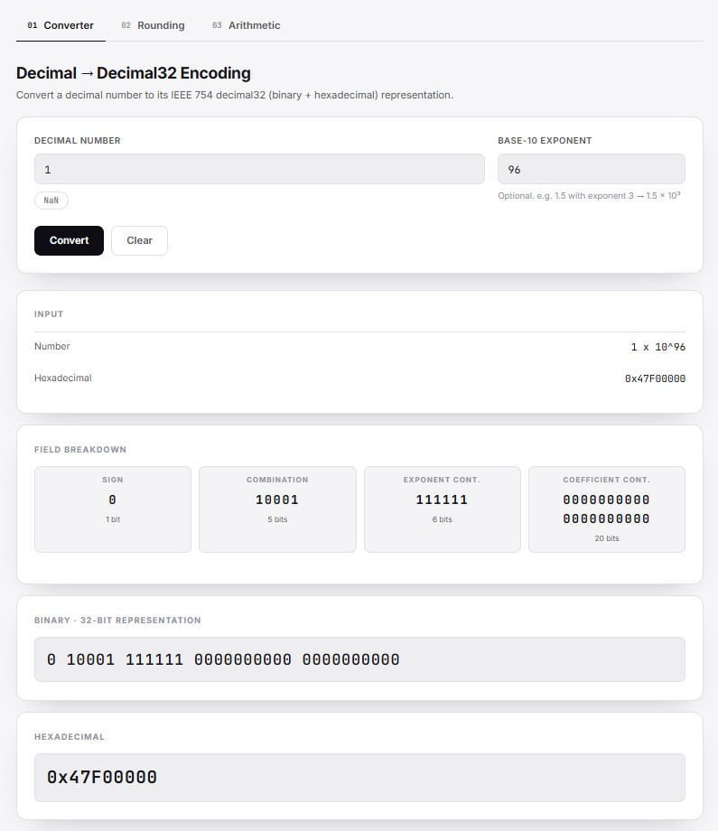

* **Lower Bound Rescue (Emin):** Demonstrates left-shift radix normalization (stripping trailing zeros) to rescue the value to the minimum denormalized bound (-101).
   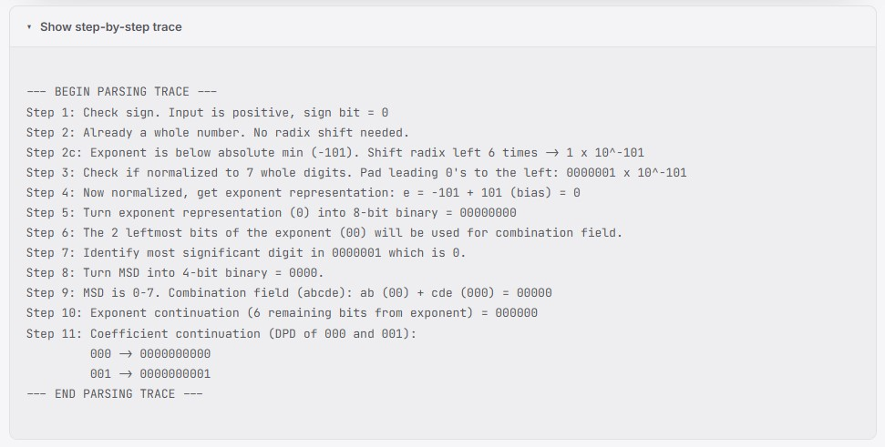
   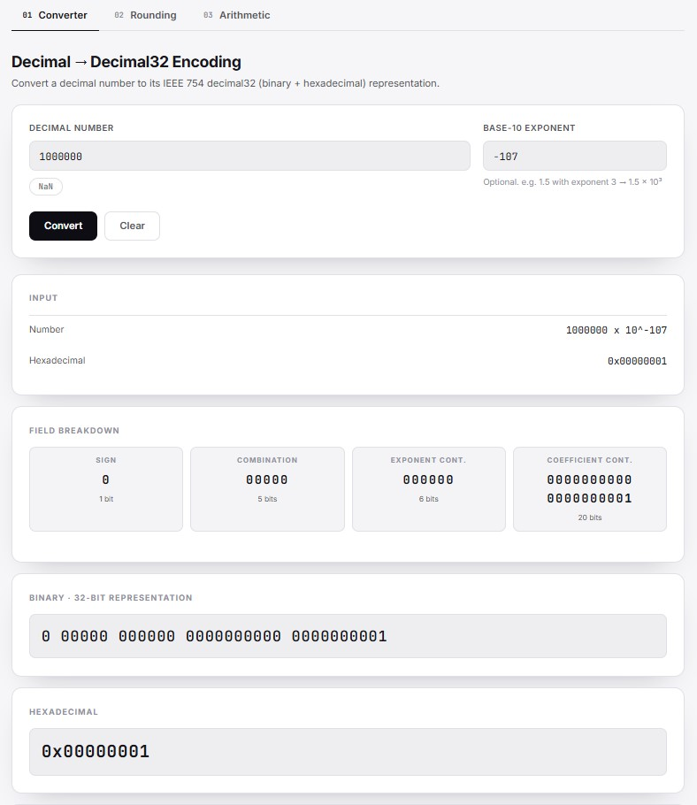

* **Hard Underflow Limit:** Proves the parser strictly defends the lower limits and correctly rejects un-rescuable values.
   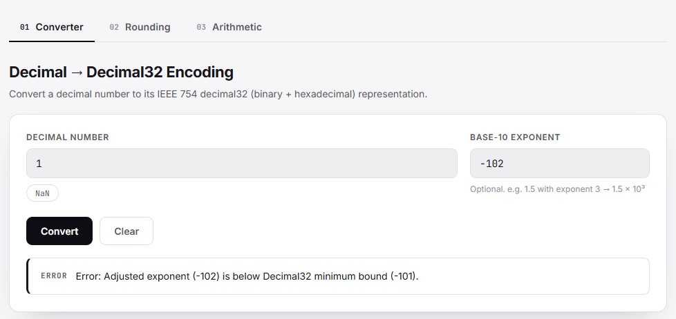

---

**[Watch our Video Walkthrough on YouTube](insert-your-link-here)**
