# Decimal 32-bit Floating-Point (Decimal32)

A web-based simulation of the IEEE 754 **decimal32** floating-point format,
built as part of the CSARCH2 computing-machine project. It includes a
monochrome (night-mode) graphical interface and reuses three Python modules
that implement the encoding, rounding, and arithmetic logic.

## Features

1. **Converter** — Converts a decimal number to its IEEE 754 decimal32
   representation (with special cases such as Infinity and NaN) in:
   - Binary, with proper field spacing
   - Hexadecimal
   - Plus a step-by-step parsing trace
2. **Rounding** — Rounds a decimal or binary number to a target precision
   using all four methods:
   - Chopping (toward zero)
   - Round up (toward +infinity)
   - Round down (toward −infinity)
   - Round to nearest, ties to even
3. **Arithmetic** — Performs subtraction or division on operands given in
   either decimal or IEEE hexadecimal form, using a selectable rounding
   method, and shows the step-by-step solution plus the final result in:
   - Decimal
   - Binary (spaced)
   - Hexadecimal

## Project structure

    ├── app.py                    # Flask web application + JSON API
    ├── decimal32.py              # Part 1: decimal → decimal32 encoder (DPD)
    ├── rounding.py               # Part 2: four rounding methods
    ├── arithmetic_operations.py  # Part 3: subtraction / division + hex decoder
    ├── requirements.txt
    ├── templates/index.html      # GUI markup (3 tabs)
    ├── screenshots/              # Documentation of terminal tests
    └── static/
        ├── css/style.css         # Night-mode stylesheet
        └── js/app.js             # Frontend logic

## Running the app

Requires Python 3.8+ and [Flask](https://flask.palletsprojects.com/).

    pip install -r requirements.txt
    python app.py

Then open <http://127.0.0.1:5000> in your browser.

## Using the terminal modules (optional)

Each module can also run standalone in the terminal:

    python decimal32.py
    python rounding.py
    python arithmetic_operations.py

## API endpoints

| Endpoint       | Method | Purpose                                              |
| -------------- | ------ | ---------------------------------------------------- |
| `/`            | GET    | Serves the web app                                   |
| `/api/encode`  | POST   | `{ base, exp }` → decimal32 binary/hex + trace       |
| `/api/round`   | POST   | `{ value, input_type, target_digits }` → 4 results   |
| `/api/arith`   | POST   | `{ operation, format, op1, op2, rounding }` → result |

## Example

| Input                        | Output |
| ---------------------------- | ------ |
| `122.5` (converter)          | `0 01000 100100 0000000001 0100100101` · `0x22400525` |
| `0.100101110 → 3 bits`       | chopping `0.100 x 2^0`, nearest `0.101 x 2^0` |
| `122.5 − 0.5` (ties to even) | `122.0` · `0 01000 100100 0000000001 0100100000` · `0x22400520` |

---

## Test Cases & Screenshots

## Decimal 32-bit Floating-Point (Decimal32)

The following screenshots demonstrate the parser's ability to handle standard conversions alongside IEEE 754 architectural extremes, proving mathematically accurate cohort normalization, boundary limits, and special formatting.

### 1. Normal Cases
* **Small MSD (0-7):** Demonstrates standard Combination Field (abcde) parsing.
   
   

* **Large MSD (8-9):** Demonstrates the required `11 + cd + e` Combination Field shift.
   
   

### 2. Special Cases
* **Positive Infinity (Induced Overflow):** Exceeds the maximum exponent limit of 90 after cohort shifting.
   
   

* **Negative Infinity (Induced Overflow):** Negative sign parsed alongside mathematical overflow limits.
   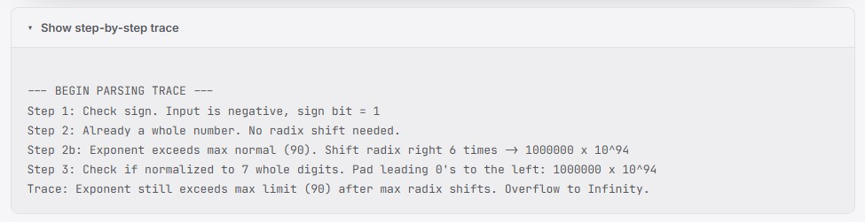
   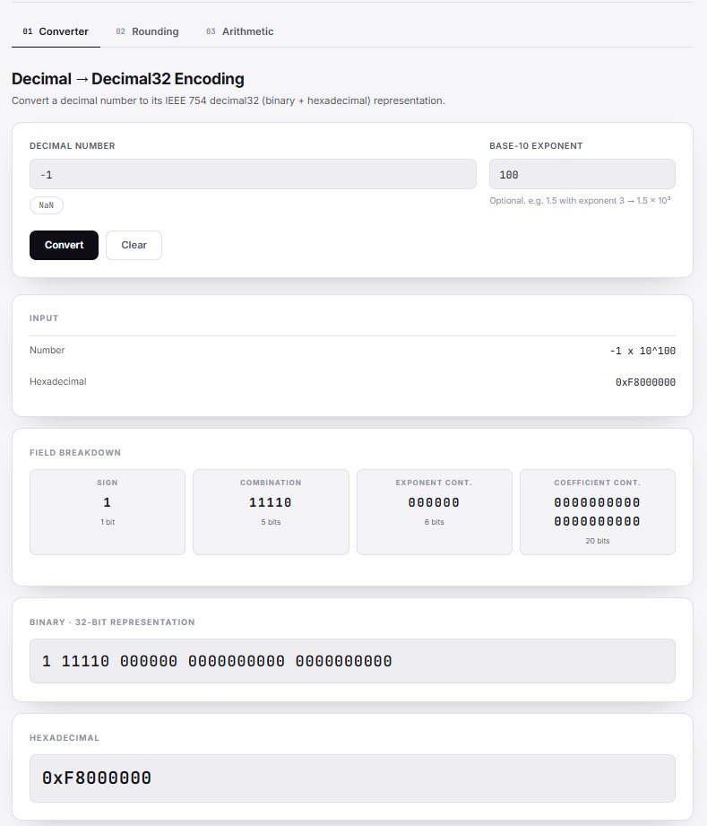

* **NaN (Not a Number):** Demonstrates explicit string catching for undefined operations.
   
   

### 3. Edge Cases
* **Signed Zeros:** Proves sign preservation and exponent bias data retention for zero values.
   
   

* **Upper Bound Cohort Shift (Emax):** Demonstrates right-shift radix normalization to drop the exponent to the maximum bound (90).
   
   

* **Lower Bound Rescue (Emin):** Demonstrates left-shift radix normalization (stripping trailing zeros) to rescue the value to the minimum denormalized bound (-101).
   
   

* **Hard Underflow Limit:** Proves the parser strictly defends the lower limits and correctly rejects un-rescuable values.
   

## Rounding Test Cases & Screenshots

The following screenshots demonstrate that the rounding module correctly
performs all four IEEE 754 rounding methods using significant digits.
The tests include normal inputs, special rounding cases, edge cases, and
invalid inputs.

### 1. Normal Cases

-   **Normal Positive Number:** Demonstrates rounding a positive decimal
    number that already matches the requested precision.
    ` `{=html}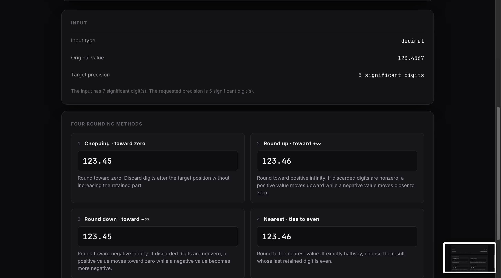

-   **Normal Negative Number:** Demonstrates rounding a negative decimal
    number using significant digits. ` `{=html}

-   **Positive Binary Input:** Demonstrates rounding a positive binary number using significant bits and all four IEEE 754 rounding methods.
   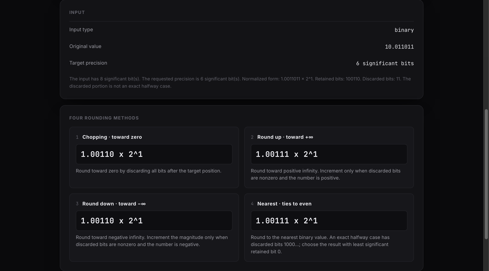

-   **Negative Binary Input:** Demonstrates rounding a negative binary number using significant bits and all four IEEE 754 rounding methods.
   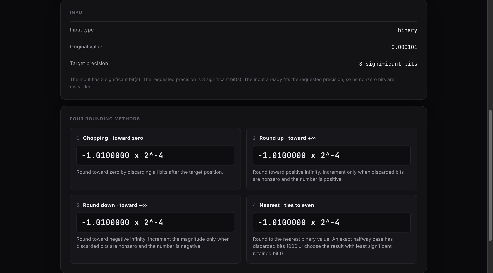

### 2. Special Cases

-   **Tie to Even (1.45 → 2 digits):** Demonstrates the tie-to-even rule
    where the last retained digit is even. ` `{=html}

-   **Tie to Even (1.55 → 2 digits):** Demonstrates the tie-to-even rule
    where the result rounds to the nearest value with an even last
    digit. ` `{=html}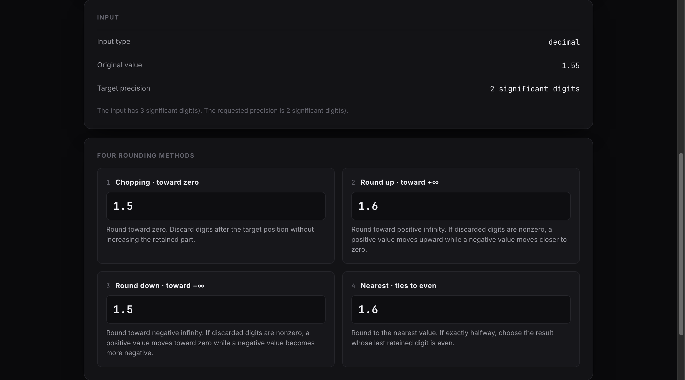

-   **Trailing Zeros:** Demonstrates that trailing zeros after the
    decimal point are treated as significant digits.
    ` `{=html}

-   **Leading Zeros:** Demonstrates that leading zeros are not counted
    as significant digits. ` `{=html}

### 3. Edge Cases

-   **Maximum Decimal32 Precision:** Demonstrates rounding a value with
    the maximum supported significant digits. ` `{=html}

-   **More Than 7 Significant Digits:** Demonstrates rounding when the
    input contains more than seven significant digits.
    ` `{=html}

### 4. Incorrect Inputs

-   **Invalid Decimal Input:** Rejects non-numeric decimal input.
    ` `{=html}

-   **Invalid Binary Input:** Rejects binary input containing invalid
    digits. ` `{=html}

-   **Invalid Decimal Format:** Rejects decimal input with multiple
    radix points. ` `{=html}

-   **Empty Input:** Rejects empty input. ` `{=html}

-   **Target Digits = 0:** Rejects a target precision of zero.
    ` `{=html}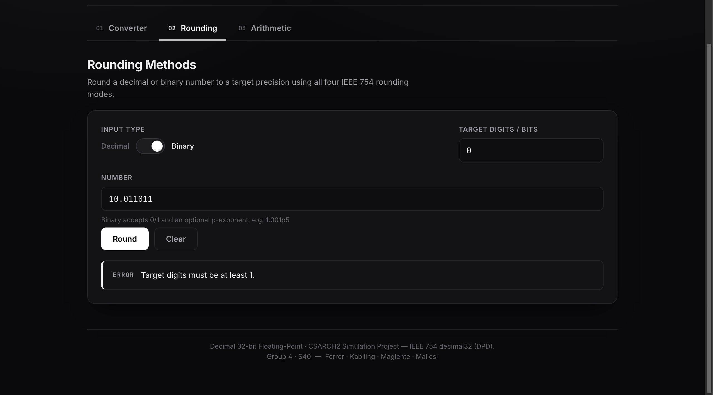

-   **Target Digits = abc:** Rejects non-numeric target precision.
    ` `{=html}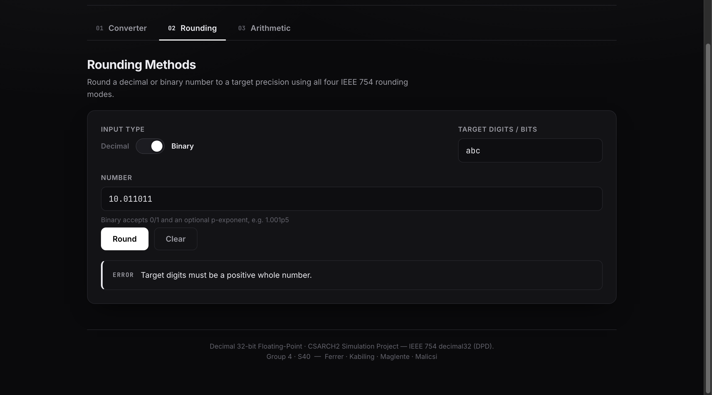

## Arithmetic Operations Test Cases & Screenshots

The following screenshots demonstrate the application's ability to perform
subtraction or division on operands. The tests confirm that the calculator
correctly processes operands given in either decimal or IEEE hexadecimal form, 
applies a selectable rounding method, and accurately displays the step-by-step 
solution alongside the final Decimal, Binary (spaced), and Hexadecimal results.

### 1. Normal Cases

-   **Decimal Subtraction:** Demonstrates a standard subtraction operation, such as `122.5 − 0.5` using the ties to even rounding method, resulting in `122.0` and its properly spaced binary and hexadecimal output `0x22400520`
   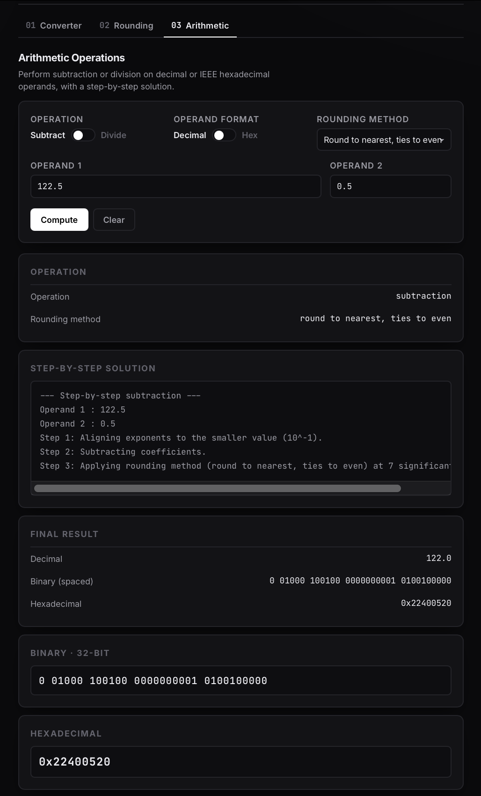

* **Hexadecimal Arithmetic:** Demonstrates decoding and performing subtraction or division on operands provided in IEEE hexadecimal form.
   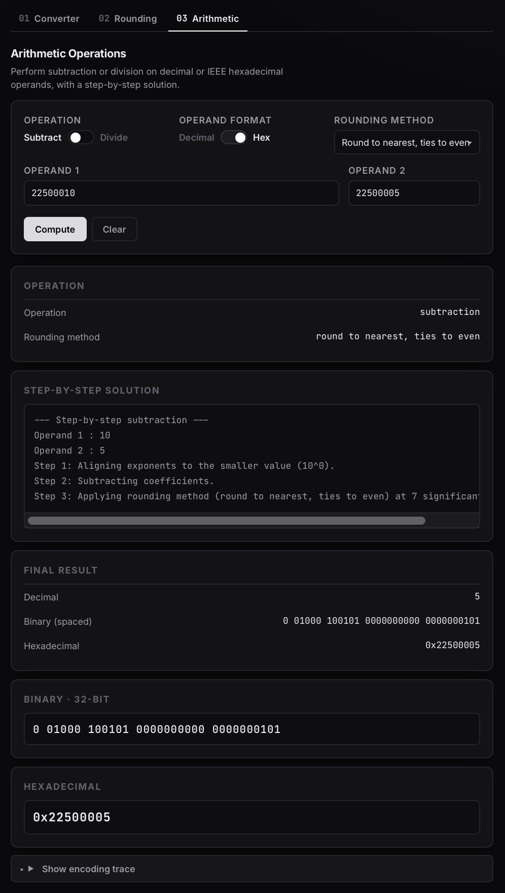

* **Division with Rounding:** Demonstrates division resulting in a repeating decimal, proving that the system successfully applies a selectable rounding method (e.g., round to nearest, ties to even) to the solution.
   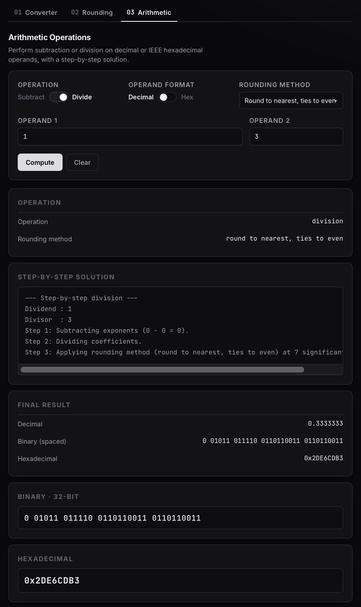

### 2. Special Cases

* **Infinity Resolution:** Demonstrates the arithmetic logic intercepting division by zero to correctly output special cases such as Infinity in Decimal, Binary, and Hexadecimal forms.
   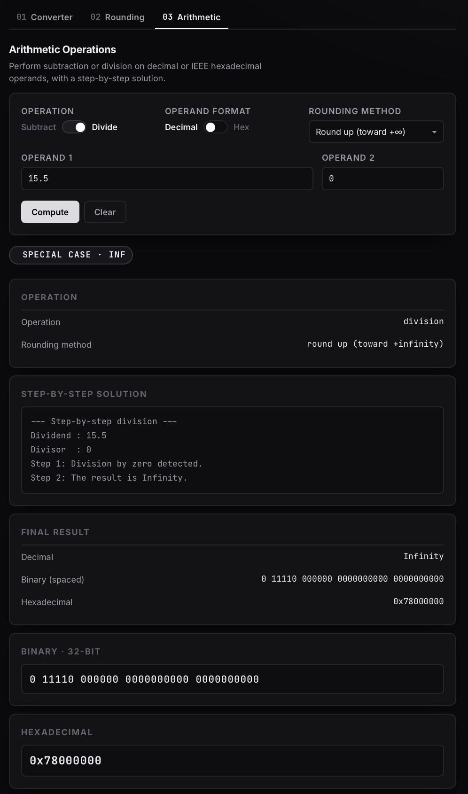

* **NaN (Not a Number) Resolution:** Demonstrates handling mathematically undefined operations (like zero divided by zero), resulting in the proper IEEE 754 NaN representation.
   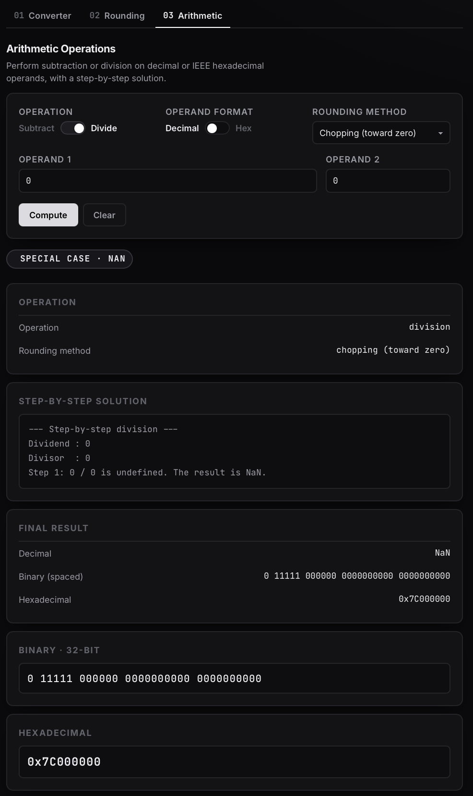

### 3. Dynamic Rounding Integration

* **Chopping (toward zero):** Demonstrates performing an arithmetic operation while actively applying the chopping rounding method to truncate the step-by-step solution.
   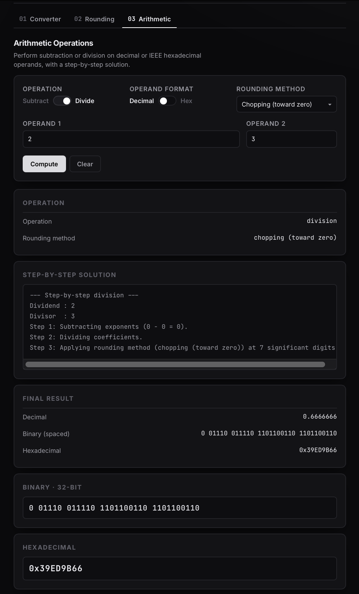

* **Round up / Round down:** Demonstrates applying round up (toward +infinity) and round down (toward -infinity) to arithmetic operations, showing real-time changes to the final binary and hexadecimal outputs.
   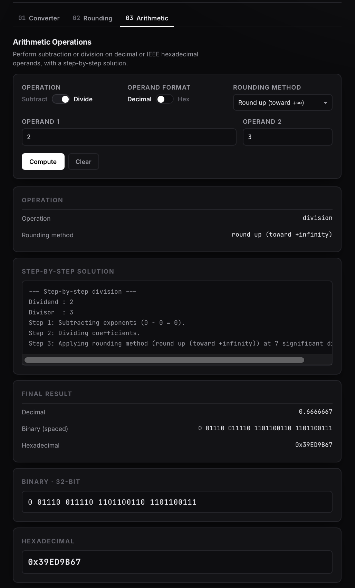

---

**[Watch our Video Walkthrough on YouTube](https://www.youtube.com/watch?v=kDjtGNjd82A)**

---
**[Visit our Website](https://csarch2-mco2-52ac.onrender.com/)**
